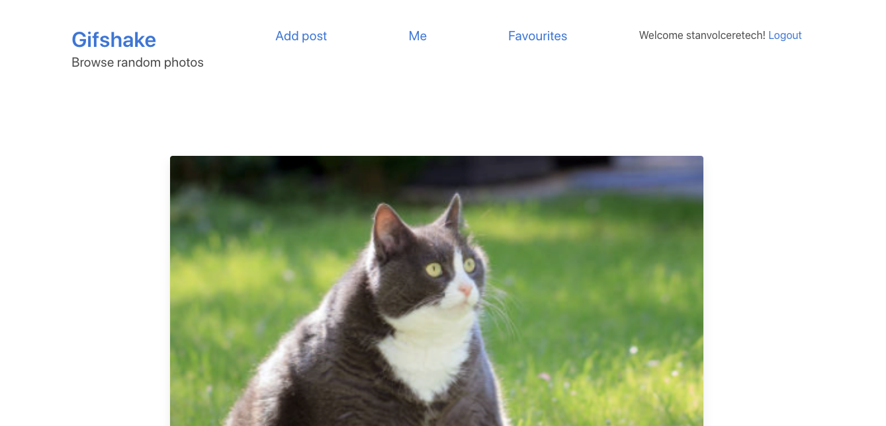

# Capstone explained

Project use case:

Image sharing platform similar to Instagram. Users share photos with other users on the platform and can choose to save their favourite photos. The 'favourites' tab on the frontend will list all the images that the user has favourited. The 'me' tab will list all the posts that were posted by the current user.

Possible actions:

- Browse posts
- Add posts
- Edit posts
- Delete posts
- Favourite posts

Key features:

## 1.Only logged-in users can use the platform

As soon the browser hits the site they will be asked to login via Auth0 portal. Upon doing so they will be redirected to the homepage where they will see existing photos.

## 2. User can 'add new post'

By clicking on 'Add post' the user gets directed to the add new post page where they can fill in the Caption, and the tags (comma separated values) associated to the photo if any. When a file has been selected and caption and tags have been enter the user can submit their post. 

Note: Validation checks will be performed to ensure the Caption is at least 3 characters long and the image has been selected.

Upon success the user will be redirected to the home page where they'll see their new post among others.

## 3. Single post view

Clicking on one of the posts will take the user to the single post view. If the user owns the post they will be able to edit or delete the post. By clicking the pencil or the trash can respsctively.

Post edit view one the edit button is clicked.

Saving the changes will redirect the user to the homepage.

4. Favorite a post

User can favourite posts that they like by clicking on the star on each post. Favourited posts can be un-favourited. Each time the star is clicked the page will refresh with the new updated. All posts that the user has liked can be view in the favourites tab.